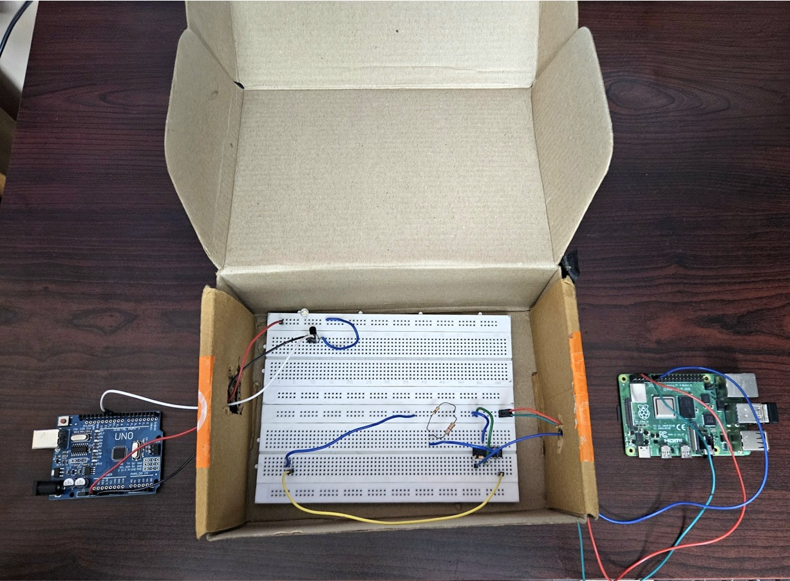
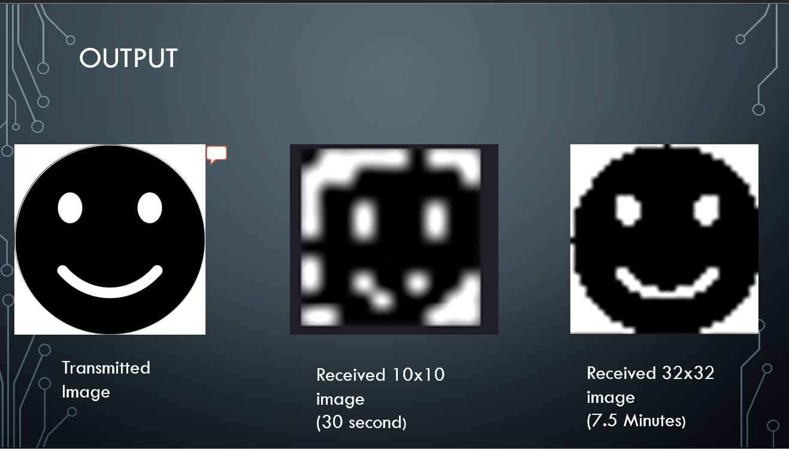

# 💡 Li-Fi Based Image Transmission

A mini-project demonstrating optical wireless communication using Li-Fi (Light Fidelity) to transmit and reconstruct grayscale images using visible light. This project uses Arduino, Raspberry Pi, a white LED, and a BPW34 photodiode to convert, send, receive, and decode image data without relying on radio frequencies.

---

## 📷 Project Overview

This system shows how images can be encoded into binary, transmitted using visible light pulses from a white LED, and then decoded back into an image at the receiver side using a photodiode and Raspberry Pi. Ideal for environments where RF communication is restricted such as hospitals or aircraft.

---

## 🚀 Features

- Wireless image transmission using visible light  
- No RF interference  
- Simple low-cost hardware setup  
- Python-controlled transmission and reception  
- Achieves data rates up to **4 bits per second**  
- Reconstructs grayscale images of resolution **10×10 or 32×32**

---

## 🛠️ System Architecture

### Transmitter Side

- Laptop with Python to convert image to binary  
- Arduino UNO for controlling data flow  
- N7000 MOSFET for fast LED switching  
- White LED to transmit optical pulses  

### Receiver Side

- BPW34 Photodiode to detect light  
- LM339 Comparator to digitize signals  
- Raspberry Pi to decode and reconstruct the image  

### 🔧 Project Hardware Setup

*(Complete Li-Fi transmitter and receiver hardware setup used in the experiment)*

---

## 🧠 How It Works

1. **Image Conversion:**  
   A Python script converts the input image into a binary stream.

2. **Transmission:**  
   Arduino toggles a white LED using the binary stream through a MOSFET.

3. **Reception:**  
   The photodiode detects LED flashes and the comparator converts the signal into digital logic.

4. **Reconstruction:**  
   Raspberry Pi reads the data and reconstructs the image using Python.

---

## 🧰 Technologies & Tools

- Python 3  
- OpenCV  
- Arduino IDE  
- Raspberry Pi (GPIO)  
- BPW34 Photodiode  
- LM339 Comparator  
- N7000 MOSFET  

---

## ⏱️ Performance

- Transmission rate: **4 bits per second**
- Delay per bit: **0.25 seconds**
- Example: **10×10 image (100 bits) transmitted in ~25 seconds**

### 🖼️ Example Reconstructed Output

*(Example grayscale image reconstructed after Li-Fi transmission)*

---

## ⚙️ Setup Instructions

### 🔌 Hardware Wiring

Refer to the block diagrams in the report for wiring:

- Arduino → MOSFET → LED  
- Photodiode → Comparator → Raspberry Pi  

---

## 🧪 Future Improvements

- Add **error correction codes (Hamming, Reed-Solomon)**  
- Implement **Manchester Encoding for synchronization**  
- Increase speed using **PWM modulation or OFDM**  
- Use **high-power LEDs for longer transmission distance**
